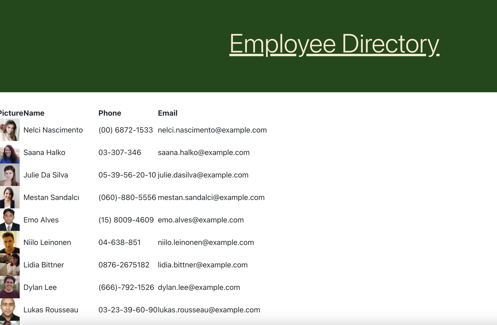

# React Employee Directory

## Table of Contents
  1. [Description](#description)
  2. [Image of product](#screenshots)
  3. [Usage](#usage)
  4. [Questions](#questions)
  
  
  
## Description 
This application is designed to allow the user to see all employees in one place.  The user will be able to sort and filter the database of employees based on their needs.  The application can be found [here](https://richardwalter515.github.io/react-employee-directory)

## Image of product 

## Usage 
To use, open the app in your browser and scroll through, sort, and filter your employees!

## Questions 
If you have any questions, you may reach out to me at richardwalter515@gmail.com
or visit me on [GitHub](https://www.github.com/richardwalter515)
